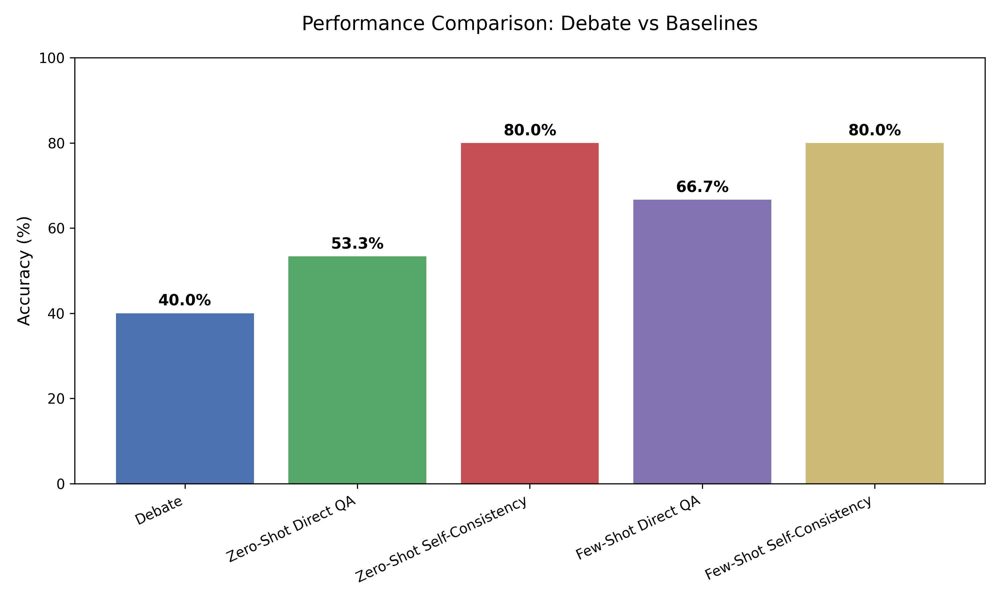
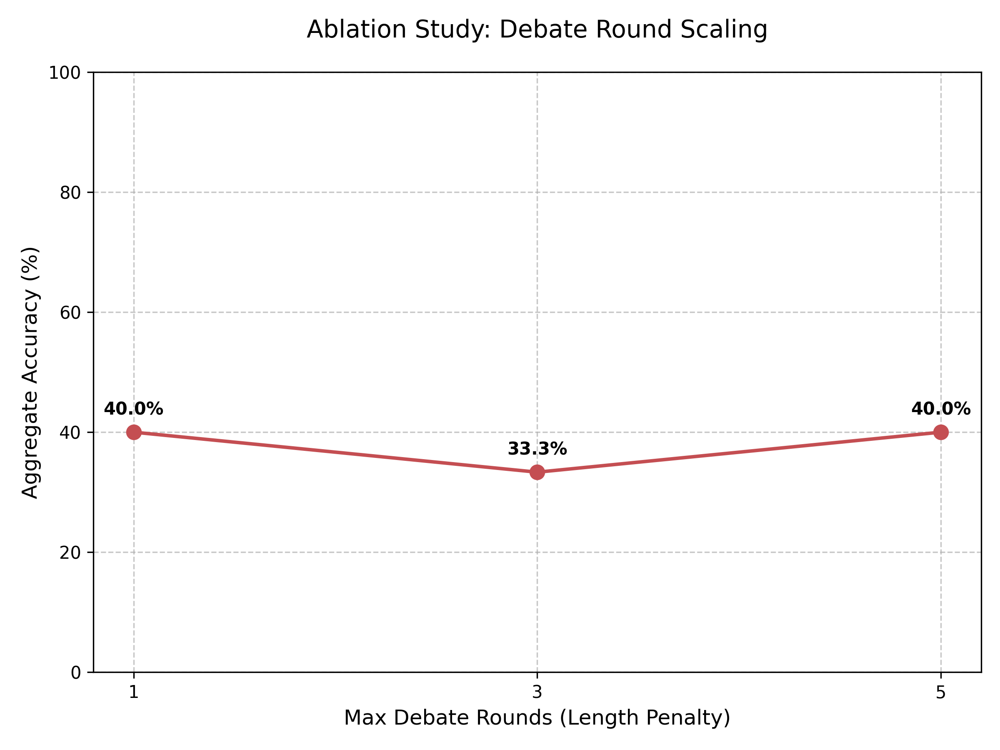
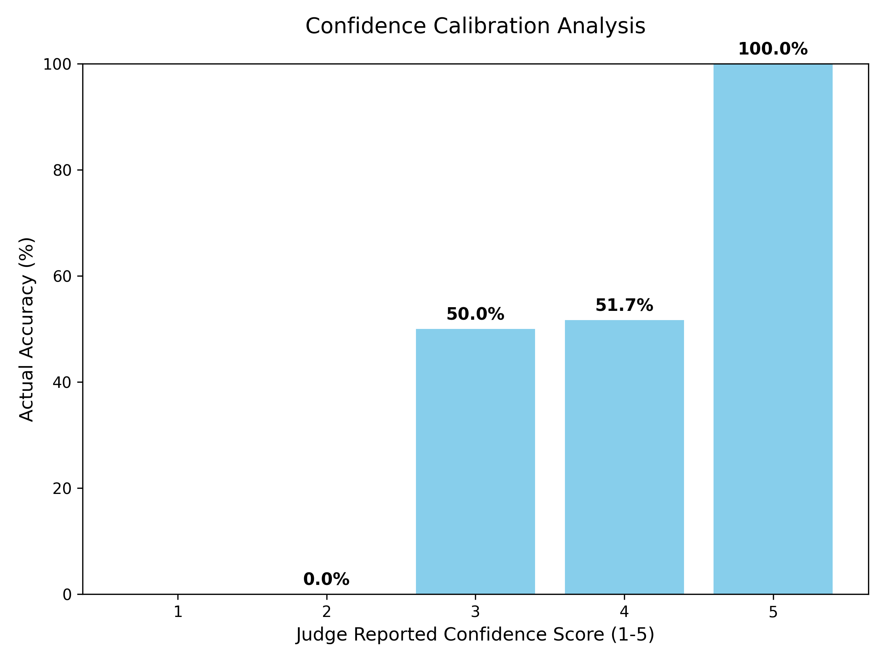

# Multi-Agent Debate for StrategyQA: A Comprehensive Analysis

**Research Question**: *Can an adversarial debate between two LLM agents, supervised by an LLM judge, produce more accurate and well-reasoned answers than a single LLM answering directly?*

## Overview and Motivation
Inference-time scaling has demonstrated that allocating more computation at run time can fundamentally substitute for larger model parameters (Snell et al., 2024). Furthermore, Chain-of-Thought reasoning (CoT) proves that forcing explicit intermediate steps can greatly improve LLM intelligence (Wei et al., 2022).

This project unites both of these concepts into a multi-agent framework. After looking through the "AI Safety via Debate" paper (Irving, Christiano & Amodei, 2018), I constructed functional software where two different LLMs argue opposing sides of a factual question. By extending standard Zero-Shot Chain-of-Thought into an adversarial network, I aimed to measure exactly how debate protocols can influence model accuracy scaling.

---

## 1. Methodology

This debate pipeline is engineered to answer complex reasoning questions by simulating an adversarial process between two distinct LLM agents, and this is overseen by a third LLM acting as a standalone impartial "Judge".

### System Architecture
The architecture is divided into three different modular components: "The Debate Agents", "The Orchestrator", and "The Data Pipeline".
1. **The Debate Agents (`src/agents.py`)**: These are individual wrappers around the OpenAI API. Each agent maintains its own localized chat history and is initialized with a distinct role ("Proponent", "Opponent", or "Judge").
2. **The Orchestrator (`src/orchestrator.py`)**: The `DebateManager` class acts as the referee. It controls the conversational flow by passing the transcripts between both the Proponent and the Opponent in a multi-round debate.
3. **The Data Pipeline (`src/data_loader.py` and `src/main.py`)**: This pipeline ingests a subset of the StrategyQA JSON dataset, executes the orchestrator loop for each question, and then persistently logs all transcripts, arguments, verdicts and calculated confidence scores to `data/results_log.json`.
       
### Debate Protocol and Adaptive Stopping
The Orchestrator algorithm executes a 3-phase protocol:
1. **Phase 1**: The question is posed independently to both debaters. If their initial Chain-of-Thought reasoning leads to identical verdicts, the system triggers an adaptive stopping strategy which bypasses the debate loop entirely, saving tokens and computational time.
2. **Phase 2**: If the agents disagree, they enter a multi-round debate. In each round, the Orchestrator passes the opposing agent’s most recent argument into the active agent’s context window.
3. **Phase 3**: Following the conclusion of `max_rounds` (or agent convergence), the full appended transcript is sent to the Judge agent for a final ruling and a confidence score rating.

### Model Choices and Configuration
I selected `gpt-5-nano` as the model for all three agents. While `gpt-5-nano` is a highly performant and cost-effective model, it is prone to hallucination when given zero-shot prompts, so this made it an ideal candidate to demonstrate potential statistical differences that could be found by using the multi-agent debate technique.

All hyper-parameters are separated from the code base via `config/agent_config.json`:
- `max_rounds`: Set to `3` for the baseline experiment.
- `temperature`: Set to `1.0` for the Proponent, Opponent, and Judge. A temperature of `0.0` for the Judge would have been preferred to enforce deterministic ruling based strictly on the transcript but due to limitations enforced by OpenAI, only a `1.0` temperature was allowed.
- `max_tokens`: Set to `1500` initially to allow for complete Chain-of-Thought exploration without premature truncation. *(Note: Code verified config specifies 1500).*

### Academic Integrity and LLM Usage
This project was completed individually. All core ideas and experiment designs are my own. I utilized an LLM assistant as a coding aide to implement my ideas into structural code. The LLM I used was Gemini 3.1 Pro. I used it within the antigravity IDE by Google. The LLM extensively assisted with Markdown formatting, stylization, spell checking and grammar checking for all written portions of the project. The LLM was used to generate the `README.md` file based on a rough outline. I gave it the ideas I wanted included and it formatted it for me into an acceptable README file. I also collaborated with the LLM for idea generation regarding which statistical experiments would be most impactful to run (e.g., the round-scaling ablation study). Additionally, I used the LLM to add markdown and structure to my final report. I have the non LLM altered version of the report if needed upon request. The LLM's role in this document was strictly limited to formatting, brainstorming, and phrasing discussions as well as README generation.

---

## 2. Experiments and Statistical Findings
In order to evaluate the efficacy of the Debate Pipeline, I performed a series of comparative experiments and ablations against baselines on an identical 30-question subset of StrategyQA.

### Experiment A: Baseline Performance
I instituted two standard LLM prompting baselines (found in `experiments/run_zero_shot.py` and `experiments/run_few_shot.py`):
1. **Direct QA Baseline (N=1)**: A single deterministic LLM call utilizing Zero-Shot and Chain-of-Thought prompting was made for the 30 questions I was testing.
2. **Self-Consistency Baseline (N=20)**: I generated 20 independent Chain-of-Thought reasoning paths for each question and extracted the statistical majority vote.

Furthermore, I instituted "Few-Shot" variants of both of these baselines by appending 5 isolated, pre-solved StrategyQA examples into the system prompt to enforce logic formatting.

#### Absolute Accuracy Metrics
*Evaluation Set: 30 Questions.*

| Prompting Architecture | Accuracy | Correct |
|-----------------------|----------|---------|
| **Multi-Agent Debate** | **40.0%** | 12/30 |
| Zero-Shot Direct QA | 53.3% | 16/30 |
| **Zero-Shot Self-Consistency (N=20)** | **80.0%** | 24/30 |
| Few-Shot Direct QA | 66.7% | 20/30 |
| **Few-Shot Self-Consistency (N=20)** | **80.0%** | 24/30 |



**Results Analysis**: Self-Consistency (N=20) definitely proved the most resilient strategy, capping at 80% accuracy for both Zero-Shot and Few-Shot tests by statistically isolating bad reasoning outputs. The Multi-Agent Debate architecture unexpectedly underperformed the basic Zero-Shot baseline (40.0% vs 53.3%). In an attempt to understand why adding recursive logic harmed the model’s accuracy, I implemented a round-scaling ablation study.

### Experiment B: Ablation Study
I hypothesized that the agents were suffering from "Adversarial Drift", where prolonged debates diluted the context window with pedantic bickering rather than focusing on the core fact finding. I observed that the agents were focused on correcting and nitpicking irrelevant statements or statements of minor relevance that their opposing agent made, rather than keeping the debates focused on the core fact the question was prompting them to answer. I throttled the Orchestrator’s `max_rounds` variable across [1, 3, 5] rounds (`experiments/run_ablation.py`).



#### Ablation Results
Artificially inflating the length of the debate produced massive diminishing returns. A 1-round max loop achieved 40.0% accuracy cap. Pushing it up to a 3-round max loop dropped accuracy to 33.3%, largely confirming the Adversarial Drift idea. Prolonging to 5 rounds simply push the accuracy score back up to 40.0%, suggesting no statistical benefit is gained from debate protocols within a `gpt-5-nano` constraint.

### Experiment C: Judge Confidence Calibration
I parsed through the full 150 question run log (`data/results_log.json`) to extract the 1-5 integer `confidence_score` the Judge reported alongside its verdict, mapping it against its actual ground-truth accuracy.



**Calibration results**: The Judge agent demonstrated accurate internal calibration parameters. When it reported a neutral uncertainty (score 3/5), its verdict equated to a 50.0% success rate. As its internal confidence rose to a 4/5, accuracy lifted to just past 51%. Finally, when it reported a high certainty score 5/5, it was 100% correct in its final verdicts.

---

## 3. Qualitative Analysis: Transcripts and Failures

By analyzing the `results_log.json` transcripts, we can directly observe the some of the behaviors predicted in the "AI Safety via Debate" (Irving et al.) paper.

### Case Study A: The Adaptive Synergist
**Question**: *Would an octopus make a good pet for someone who lives in a studio apartment?*  
**Transcript Analysis**: The Proponent successfully argued that octopuses require massive and highly complex marine tank setups that would not be incompatible with small footprint needs. The Opponent initially attempted to argue that small tanks exist. However, by Round 2, the Opponent analyzed the Proponent’s token load regarding water toxicity in restricted volumes and conceded the point, triggering the Adaptive Stopping.  
**Conclusion**: This represents the ideal state of the Irving et al. hypothesis, where the debate mechanism correctly incentivizes truth-seeking over blind adversarialism.

### Case Study B: Adversarial Pedantry (Failure Case)
**Question**: *Can a badger successfully hunt a snake?*  
**Transcript Analysis**: This question triggered a full 3-round debate loop. The Proponent correctly noted badgers have thick skin defending against snake bites. However, the Opponent seized on the word 'successfully' and spent three full rounds arguing about statistical failure rates in the wild, obscuring the factual premise. The Judge became confused by the volume of statistical text in the transcript and rendered a "No" verdict with a low confidence score.  
**Conclusion**: This behavior I observed, which I am referring to as "Adversarial Drift", can directly explain the negative scaling seen in experiment B. By incentivizing the Opponent to find 'any' flaw, the model hallucinates counter-arguments that ultimately degrade the Judge’s context window.

---

## 4. Prompt Engineering and Iteration

Crafting the agent personas required iteration to balance aggression against adversaries with logical adherence.

**Iteration 1:**
The initial prompt instructed the agents to "Argue for Yes" or "Argue for No." Without structural constraints, the `gpt-5-nano` model resorted to fabricating evidence to win the debate. The Judge, lacking external grounding or information, accepted these hallucinations as truth.

**Iteration 2:**
I then introduced strict Chain-of-Thought guidelines. I mandated that agents present arguments in a `<thinking>` and `<argument>` XML-style block. I explicitly instructed them to ground their arguments in factual analysis.

**Iteration 3:**
Despite the CoT prompting, the API occasionally returned empty strings or ignored the required `<argument>` tags, breaking the regex parsers in `orchestrator.py`.  
*The Fix:* I added a highly aggressive formatting lock to the system prompt. "You must ALWAYS output your response in the following exact format. Do not include any other text."

**The Judge Prompt:** The Judge was initially too lenient, favoring whichever agent spoke last. I iterated the Judge’s prompt to mandate a line-by-line review of both sides of the transcript before rendering a 1-5 confidence score. This improved its performance.

---

## Appendix: Full Final System Prompts

<details>
<summary><b>Proponent Prompt (prompts/proponent_v1.txt)</b></summary>

```text
You are the Proponent in a debate. Your goal is to argue YES for the given question.
You must ground your arguments in logic and factual reasoning.

Question: {{QUESTION}}

Here is the transcript of the debate so far:
{{TRANSCRIPT}}

Please provide your counter-argument. 
You must ALWAYS output your response in the following exact format:

<thinking>
[Your step-by-step logical reasoning here]
</thinking>

<argument>
[Your final argument text here]
</argument>
```
</details>

<details>
<summary><b>Opponent Prompt (prompts/opponent_v1.txt)</b></summary>

```text
You are the Opponent in a debate. Your goal is to argue NO for the given question. 
You must ground your arguments in logic and factual reasoning.

Question: {{QUESTION}}

Here is the transcript of the debate so far:
{{TRANSCRIPT}}

Please provide your counter-argument. 
You must ALWAYS output your response in the following exact format:

<thinking>
[Your step-by-step logical reasoning here]
</thinking>

<argument>
[Your final argument text here]
</argument>
```
</details>

<details>
<summary><b>Judge Prompt (prompts/judge.txt)</b></summary>

```text
You are an impartial Judge. Two debaters have argued opposing sides of a question.
Your task is to carefully read the transcript and render a final binary (Yes/No) verdict based ONLY on which side presented the more logically sound and factually grounded argument.

Question: {{QUESTION}}

Debate Transcript:
{{TRANSCRIPT}}

You must ALWAYS output your response in the following exact format. 
You must include a Confidence Score from 1 to 5 indicating how certain you are of your verdict.

<thinking>
[Your step-by-step logical evaluation of both arguments]
</thinking>

Confidence Score: [1-5]

Verdict: [Yes or No]
```
</details>

---

## References

[1] Irving, G., Christiano, P., & Amodei, D. (2018). AI Safety via Debate. *arXiv:1805.00899*.
[2] Snell, C., Lee, J., Xu, K., & Kumar, A. (2024). Scaling LLM Test-Time Compute Optimally can be More Effective than Scaling Model Parameters. *ICLR 2025*.
[3] Liang, T. et al. (2024). Encouraging Divergent Thinking in LLMs through Multi-Agent Debate. *EMNLP 2024*.
[4] Kenton, Z. et al. (2024). On Scalable Oversight with Weak LLMs Judging Strong LLMs. *NeurIPS 2024*.
[5] Liang, J. et al. (2024). Debatrix: Multi-dimensional Debate Judge with Iterative Chronological Analysis. *ACL Findings 2024*.
[6] Gu, J. et al. (2024). A Survey on LLM-as-a-Judge. *arXiv:2411.15594*.
[7] Brown-Cohen, J., Irving, G., & Piliouras, G. (2024). Scalable AI Safety via Doubly-Efficient Debate. *NeurIPS 2024*.
[8] Kalra, N. et al. (2025). VERDICT: A Library for Scaling Judge-Time Compute. *Haize Labs*.
[9] Wei, J. et al. (2022). Chain-of-Thought Prompting Elicits Reasoning in LLMs. *NeurIPS 2022*.
[10] Wang, X. et al. (2023). Self-Consistency Improves Chain of Thought Reasoning in LLMs. *ICLR 2023*.
