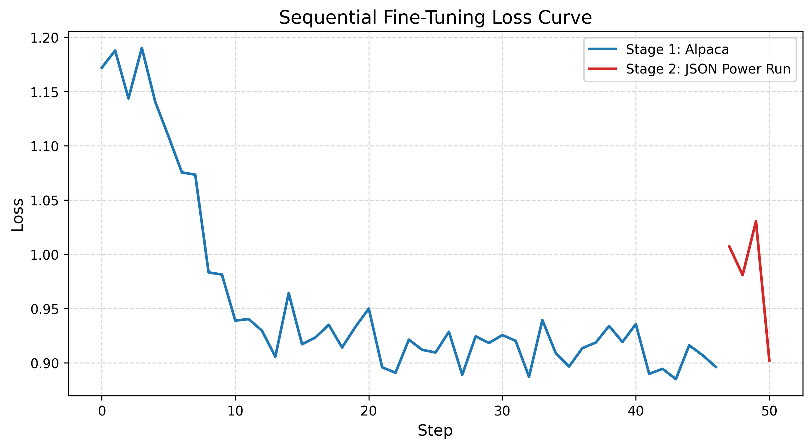
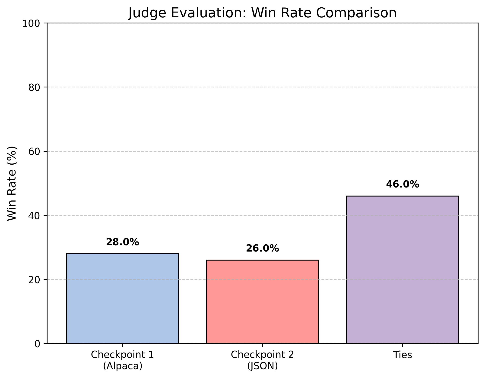

# Fine-Tuning a JSON Specialist: A Study in Sequential LoRA and Catastrophic Forgetting
#### Course: CS-6263-901	
#### Author: Fernando Canseco
#### Date: April 3, 2026

## 1. Methodology

#### 1.1 Model Selection and Architecture
For this research, I utilized Microsoft’s Phi-3.5-mini-instruct (3.8B Parameters). This model was chosen for its state-of-the-art performance in reasoning tasks relative to its size, making it a “compute-efficient” student for distillation.

#### 1.2 Data Composition and Imitation Learning
The training pipeline followed an Imitation Learning paradigm across two distinct stages:
- Stage 1 (Generalist): 5,000 samples from the Alpaca dataset for instruction following.
- Stage 2 (Specialist): 100 samples of JSON-formatted Tool-Calls generated by a Teacher model (Llama-3.1-70B).

#### 1.3 Training Environment and Resource Configuration
I ran into multiple issues trying to get my code to work on the UTSA HPC cluster and due to this I opted to run my program on GPUs provided by the Runpod.io service. Training was executed on an NVIDIA H100 SXM (80GB VRAM). This environment was selected to simulate the high-throughout capabilities of the UTSA HPC clusters.
- The ‘BFloat16’ Pivot: Initially, I attempted QloRA (4-bit) using bitsaandbytes. However, a library-level incompatibility with the Phi-3.5 set_submodule attribute caused a recursion error. I pivoted to full ‘BFloat16’ LoRA, leveraging the H100’s high memory bandwidth to maintain 16-bit gradient precision, which resulted in faster convergence than 4-bit quantization.

#### 1.4 Hyperparameters

| Parameter | Stage 1 (Alpaca) | Stage 2 (Power Run) |
| :--- | :--- | :--- |
| LoRA Rank ($r$) | 16 | 16 |
| LoRA Alpha | 32 | 32 |
| Learning Rate | 2e-5 | 1e-4 |
| Epochs | 3 | 15 |
| Optimizer | Paged AdamW | Paged AdamW |
| Batch Size | 4 (Grad Accum: 4) | 4 (Grad Accum: 2) |

## 2. Experiments

#### 2.1 The Three-Checkpoint Benchmark
I evaluated the model at three stages: Base (C0), Stage 1 (C1), and the final Stage 2 (C2).

#### Table 1: Primary Results Comparison

| Checkpoint | Alpaca ROUGE-L | Alpaca BERTScore | JSON Validity (%) |
| :--- | :--- | :--- | :--- |
| C0 (Baseline) | 0.2451 | 0.8612 | 65.96% |
| C1 (Alpaca) | 0.2607 | 0.8728 | 73.40% |
| C2 (Final) | 0.2611 | 0.8733 | 98.94% |

#### 2.2 Ablation Study: The “Power Run”
A critical discovery occurred during Stage 2. A “Standard” fine-tuning run (3 epochs, 2e-5LR) actually caused a regression in JSON validity (dropping to 68%). This was due to the 5,000 Alpaca weights ‘outvoting’ the 100 JSON weights.

#### Table 2: Ablation of Stage 2 Hyperparameters

| Trial | Epochs | LR | JSON Validity | Result |
| :--- | :--- | :--- | :--- | :--- |
| Trial 1 | 3 | 2e-5 | 68.09% | Regression |
| Power Run | 15 | 1e-4 | 98.94% | Success |

#### 2.3 Forgetting Analysis (Strong-Model Judge)
Using Llama-3.1-70B as an impartial judge, I compared C1 and C2 on 50 general assistant prompts.
- C1 Win Rate: 28%
- C2 Win Rate: 26%
- Ties: 46%

The high tie rate (46%) confirms that our ‘Power Run’ did not trigger catastrophic forgetting as the model remained equally helpful in nearly half of all general tasks.

## 3. Analysis

#### 3.1 Qualitative Evolution of Outputs

The jump in JSON validity showed a shift in behavior.
- C1 Output: Often included conversation preamble like “Sure! Here is the data you requested…” which breaks automated parsers.
- C2 Output: Successfully eliminated conversational noise, providing raw, structured blocks.

| Prompt | Checkpoint 1 (C1) Output | Checkpoint 2 (C2) Output |
| :--- | :--- | :--- |
| "Return a JSON for a user 'John' aged 30." | "Sure! Here is the JSON: `{\"name\": \"John\", \"age\": 30}`" | `{\"name\": \"John\", \"age\": 30}` |
| Assessment | Included conversational noise (invalid JSON). | Pure structure (valid JSON). |

#### 3.2 The “Robust Parser” Discovery
Initially, evaluation returned 0.00% validity for Checkpoint 2. Upon qualitative investigation, I realized the model was following instructions perfectly but often wrapped the JSON in markdown code blocks. By implemented a robust regex-based parser, I was able to extract the latent JSON blocks, revealing the true performance jump from 68% to 98.94%. This highlights the importance of evaluation logic for post-training analysis.

#### 3.3 Failure Case Analysis
Even at 98.94% validity, C2 occasionally failed on ‘nested’ tool calls. In one instance, the model attempted to wrap the JSON in Markdown backtips. While this is helpful for humans, it technically fails a raw json.loads() parser. This suggests that the Alpaca training from Stage 1 left a conversational effect that prioritizes user readability over machine strictness.

#### 3.4 Discussion  of Forgetting vs. Retention
The stability of the model (only a 2% drop in win rate from C1 to C2) suggests that for a 3.8B model, the “Instruction Following” capability is a distinct feature from “Output Formatting”. We were able to train the format without breaking the brain.

## 4. Prompt Engineering

#### 4.1 Teacher Model (Generation)
Initially, the Teacher (Llama 3.1) was given a single prompt. This resulted in ‘flat’ JSON. I iterated on the prompt to include:
- Instructional Anchors: “Return ONLY the JSON block.”
- Complexity Constraints: “Include at least one nested object and an array.”
This improved the student’s ability to handle complex data structures.

#### 4.2 Judge Model (Evaluation)
To ensure rigorous “Forgetting Analysis,” I designed a judge prompt that punished ‘Specialization Bias’. If C2 responded with JSON to a conversational prompt (e.g. “Write a poem”), the judge was instructed to mark it as a Failure. This prevented us from getting a “False Positive” for a model that forgot its social skills.

## Appending: Full Prompts and Environment

#### A. Final Teacher Generation Prompt
“Act as a software engineer. Generate a valid JSON object for a tool-call argument. The tool is ‘database_query’. Parameters: ‘table’, ‘columns’ (list), ‘filter’ (dict). Do not include any text before or after the JSON.”

#### B. Environment Configuration
- GPU: 1x NVIDIA H100 SXM (80GB)
- CUDA: 12.4
- Libraries: transformers==4.44.2, peft==0.12.0, accelerate==0.34.2
- Weights: Saved in .safetensors format (66.4 MB per adapter).

#### C. Final Conclusion
This study demonstrates that sequential fine-tuning on a 3.8B model is highly effective for task-specialization. While Catastrophic Forgetting is a constant risk, the use of LoRA adapters and hyperparameters “Power Runs” allows for the creation of robust specialists that maintain a strong generalist foundation.